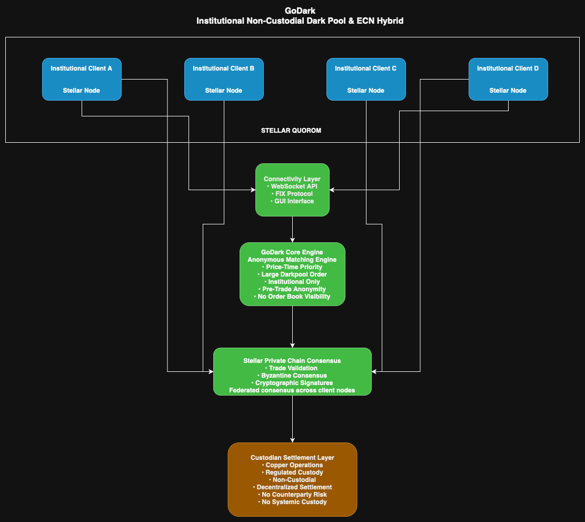
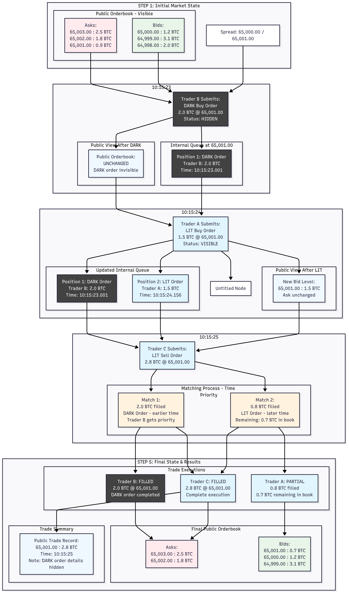
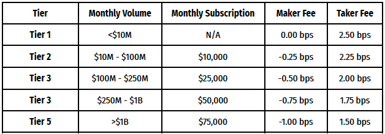

# GoDark 

GoDark is GoQuant's institutional-only, non-custodial dark pool and ECN hybrid for digital asset trading. It enables clients to cross spot crypto positions directly between wallets using a private matching engine. Designed for latency-sensitive institutions, GoDark ensures anonymous execution and efficient settlement without GoQuant ever taking custody of funds or acting as a counterparty.

## Table of Contents

- [Core Concept](#core-concept)
- [Product Architecture](#product-architecture)
- [Order Types and Execution](#order-types-and-execution)
- [Pegged Orders - Intelligent Price Tracking](#pegged-orders---intelligent-price-tracking)
- [Dark and LIT matching system](#dark-and-lit-orders-matching-system)
- [Advanced Trade Protection System](#advanced-trade-protection-system)
- [Rate Limiting Rules - Important for Clients](#rate-limiting-rules---important-for-clients)
- [Network Architecture & Connectivity Options](#network-architecture--connectivity-options)
- [Settlement Infrastructure](#settlement-infrastructure)
- [Access and Usage](#access-and-usage)
- [Account Management, Trade Logs, and Auditability](#account-management-trade-logs-and-auditability)
- [Market Data and Analytics](#market-data-and-analytics)
- [Legal and Compliance](#legal-and-compliance)
- [Use Case](#use-case)

## Core Concept

### What is GoDark?

GoDark represents the next generation of cryptocurrency trading infrastructure, built specifically for institutional traders who require:

- **Privacy**: Execute large orders without market exposure
- **Efficiency**: Ultra-low latency order matching and execution (sub-microsecond processing)
- **Protection**: Advanced safeguards against market manipulation and adverse selection
- **Connectivity**: Seamless integration with major cryptocurrency exchanges

## Product Architecture

### Core Trading Engine

The platform's heart is a high-performance matching engine that:
- Processes orders in **496.3 nanoseconds** average order matching latency
- Maintains separate order books for each trading pair
- Implements sophisticated matching algorithms with comprehensive trade rules
- Provides comprehensive audit trails and compliance monitoring
- Achieves **2+ million operations per second** throughput

## Darkpool Blockchain

GoDark operates on a private, permissioned blockchain infrastructure designed to provide immutable audit trails and consensus validation for all matched orders. This proprietary blockchain technology ensures transparency, security, and regulatory compliance while maintaining the privacy requirements of institutional trading.

### Core Functionality

**Order Validation and Consensus**
- **Consensus Protocol**: Implements a Byzantine Fault Tolerant (BFT) consensus mechanism to validate all order matches
- **Commit Hash Generation**: Each matched order generates a cryptographically secure commit hash for immutable record-keeping
- **Voting Mechanism**: Network participants reach consensus on order validity through a distributed voting protocol

**Audit Trail and Compliance**
- **Immutable Records**: All matched orders are permanently recorded on the blockchain with nanosecond precision timestamps
- **Regulatory Compliance**: Complete audit trail supports institutional compliance requirements and regulatory reporting
- **Data Integrity**: Cryptographic signatures ensure tamper-proof records and prevent unauthorized modifications
- **Historical Access**: Full order history available for compliance audits and dispute resolution

### Access Control and Privacy

**Permissioned Network**
- **Exclusive Access**: Only authorized GoDark participants can access the blockchain infrastructure
- **Lit Orderbook Visibility**: LIT order books are published on the blockchain and can onlty be viwed by GoDark participants. No counter parties outside of GoDark are involved here.
- **Dark Order Protection**: Dark orders remain internal to the matching engine and are not published to the blockchain
- **Network Security**: Advanced encryption and access controls protect against unauthorized access

**Data Segregation**
- **Public Data**: Lit orders and market statistics are visible to all network participants
- **Private Data**: Dark orders, participant identities, and sensitive trading information remain confidential
- **Selective Disclosure**: Participants control the visibility of their trading activity through order attributes
- **Compliance Balance**: Maintains transparency for regulatory purposes while preserving trading privacy

### Technical Architecture

**Blockchain Infrastructure**
- **Distributed Ledger**: Decentralized record-keeping across multiple network nodes
- **Smart Contract Integration**: Automated execution of trading rules and settlement logic
- **Scalability**: Designed to handle high-frequency trading volumes with minimal latency impact
- **Fault Tolerance**: Redundant infrastructure ensures continuous operation and data availability

**Integration with Matching Engine**
- **Seamless Operation**: Blockchain validation occurs transparently without impacting trading performance
- **Real-Time Synchronization**: Order matches are immediately recorded and validated on the blockchain
- **Performance Optimization**: Optimized consensus algorithms minimize latency overhead
- **Reliability**: 99.99% uptime guarantee with automatic failover and recovery mechanisms

## Order Types and Execution

### Available Order Types for Clients

**Limit Orders**
- **Purpose**: Execute only at your specified price or better
- **Use Case**: When price control is more important than immediate execution
- **Behavior**: Order remains in queue until market reaches your price
- **Ideal For**: Patient trading strategies, specific price targets

**Market Orders**
- **Purpose**: Execute immediately at best available market prices
- **Use Case**: When immediate execution is more important than price control
- **Behavior**: Order executes against all available liquidity regardless of price level
- **Ideal For**: Urgent execution needs, liquidity testing, immediate position changes
- **Price Discovery**: Market orders consume liquidity from both DARK and LIT orders
- **Execution Guarantee**: Market orders execute immediately or are rejected if no liquidity exists

### Time-in-Force Options

**Good Till Cancelled (GTC) - Default Setting**
- **Duration**: Orders remain active until you cancel them or they're filled
- **Client Benefit**: No need to resubmit orders; maintains position in queue
- **Best For**: Long-term strategies, patient accumulation/distribution
- **Note**: Orders persist across trading sessions

**Immediate or Cancel (IOC)**
- **Duration**: Execute immediately available quantity, cancel remainder
- **Client Benefit**: Prevents orders from sitting in book, immediate feedback
- **Best For**: Testing liquidity, avoiding market exposure
- **Result**: Partial fills possible, no resting orders

**Good Till Date (GTD)**
- **Duration**: Automatically expires at your specified date/time
- **Client Benefit**: Automated order management, prevents stale orders
- **Best For**: Time-sensitive strategies, event-driven trading
- **Flexibility**: Set custom expiration times

### Execution Attributes

**Standard Execution**
- **Behavior**: Allows partial fills over multiple transactions
- **Advantage**: Maximizes fill probability for large orders
- **Client Impact**: May receive multiple execution reports for single order
- **Recommended For**: Most institutional trading scenarios

**Fill or Kill (FOK)**
- **Behavior**: Execute complete order immediately or cancel entirely
- **Advantage**: Maintains order size integrity, no partial executions
- **Client Impact**: All-or-nothing execution, immediate result
- **Recommended For**: When complete fill is required (e.g., arbitrage)

**Min Qty**
- **Behavior**: Prevents partial fills but allows order to remain active
- **Advantage**: Ensures minimum execution size, maintains queue position
- **Client Impact**: Reduces small, uneconomical fills
- **Recommended For**: When minimum execution sizes are critical

**All or None (AON)**
- **Behavior**: Execute complete order or remain unfilled - no partial executions
- **Advantage**: Guarantees complete position sizing, prevents fragmented fills
- **Client Impact**: All-or-nothing execution with patience for complete liquidity
- **Recommended For**: Large block trading, algorithmic strategies requiring precise position sizing
- **Use Cases**: Institutional block trades, OTC-style execution, risk management strategies
- **Matching Logic**: Waits in order book until sufficient liquidity becomes available for complete fill

### Dark/Lit Order Visibility Options

**Order Visibility Control**
- **Purpose**: Optional order attribute (`order_visibility`) allowing clients to control order visibility in the marketplace
- **Configuration**: Simple DARK/LIT option for each order submission
- **Flexibility**: Per-order control enabling mixed strategies within single trading session
- **Default Behavior**: Configurable at account level with per-order override capability

**Dark Orders - Concealed Execution**
- **Behavior**: Orders remain completely hidden from orderbook published on the darkpool blockchain
- **Advantage**: Prevents market impact and information leakage for large institutional orders
- **Client Benefit**: Execute significant positions without revealing trading intentions
- **Use Cases**: Block trading, accumulation/distribution strategies, sensitive institutional flows
- **Matching Priority**: Maintains strict time priority in the matching engine while remaining completely invisible to market participants. Dark orders are processed in chronological order based on submission timestamp, ensuring fair execution regardless of visibility status.

**Lit Orders - Transparent Execution**
- **Behavior**: Orders displayed in orderbook published on the darkpool blockchain visible to all network participants
- **Advantage**: Provides market transparency and may attract contra-side interest
- **Client Benefit**: Contributes to price discovery and market liquidity provision
- **Use Cases**: Market making strategies, price discovery, signaling trading intentions
- **Public Visibility**: Full order details visible including price, size, and market depth

**Hybrid Trading Strategies**
- **Mixed Execution**: Clients can simultaneously submit both dark and lit orders
- **Strategic Flexibility**: Combine hidden liquidity provision with visible market making
- **Order Management**: Independent control over each order's visibility status
- **Dynamic Adjustment**: Modify order visibility through cancel/replace operations

**Technical Implementation**
- **Performance Impact**: Zero latency overhead for visibility control processing
- **Order Book Separation**: Lit orders populate orderbook published on the darkpool blockchain while dark orders remain internal
- **Matching Logic**: Dark and lit orders can match against each other seamlessly
- **Priority Preservation**: Time priority is maintained regardless of visibility status. Order matching occurs based on arrival time, with visibility having no impact on matching priority. The purpose of visibility control is to conceal orders from public order books.

**Client Benefits**
- **Strategy Protection**: Hide large orders to prevent adverse selection and front-running
- **Market Impact Control**: Reduce market impact through concealed order execution
- **Liquidity Provision**: Contribute to visible market depth when strategically beneficial
- **Execution Flexibility**: Choose optimal visibility strategy for each individual order

### Pegged Orders - Intelligent Price Tracking

**Purpose and Benefits**
- **Dynamic Price Adjustment**: Order prices automatically adjust in real-time based on market conditions
- **Optimal Positioning**: Maintains competitive price positioning without manual intervention
- **Market Impact Reduction**: Reduces adverse selection and information leakage
- **Execution Efficiency**: Improves fill probability while maintaining price discipline

**Available Pegged Order Types**

**Peg to Mid (PEG_TO_MID)**
- **Reference Price**: Midpoint between best bid and best ask prices
- **Behavior**: Automatically adjusts to maintain midpoint pricing as market moves
- **Advantage**: Provides potential price improvement by trading inside the spread
- **Use Cases**: Market making strategies, seeking best execution prices
- **Example**: If BBO is 65,000/65,001, peg-to-mid orders will price at 65,000.50

**Peg to Bid (PEG_TO_BID)**
- **Reference Price**: Current best bid price in the market
- **Behavior**: Order price tracks and adjusts with changes to the best bid
- **Advantage**: Maintains position at or near best bid for liquidity provision
- **Use Cases**: Passive liquidity provision, market making on bid side
- **Example**: If best bid is 64,999, buy orders will automatically adjust to 64,999

**Peg to Ask (PEG_TO_ASK)**
- **Reference Price**: Current best ask price in the market
- **Behavior**: Order price tracks and adjusts with changes to the best ask
- **Advantage**: Maintains position at or near best ask for liquidity provision
- **Use Cases**: Passive liquidity provision, market making on ask side
- **Example**: If best ask is 65,001, sell orders will automatically adjust to 65,001

**Technical Implementation**
- **Sub-Microsecond Repricing**: Pegged orders reprice instantly when reference prices change
- **Price Discovery Integration**: Seamlessly integrates with GoDark's price discovery mechanism
- **Order Book Priority**: Maintains time priority while adjusting price levels
- **Automatic Management**: No manual intervention required for price adjustments
- **Cross-Market Synchronization**: Tracks best prices across all connected venues

**Client Benefits**
- **Hands-Free Management**: Eliminates need for constant manual price adjustments
- **Optimal Execution**: Automatically seeks best available prices
- **Reduced Monitoring**: Less intensive order management requirements
- **Strategy Protection**: Maintains competitive positioning without revealing intentions
- **Improved Fill Rates**: Higher probability of execution through intelligent pricing

**Risk Management**
- **Limit Price Protection**: Pegged orders respect maximum/minimum price limits
- **Market Condition Monitoring**: Automatic adjustment suspension during volatile periods
- **Validation Checks**: Real-time validation ensures pegged prices remain within reasonable bounds
- **Fallback Mechanisms**: Graceful handling when reference prices become unavailable

**Order Lifecycle**
- **Initial Pricing**: Pegged orders are priced based on current market conditions upon entry
- **Dynamic Repricing**: Continuous adjustment as Best Bid/Offer (BBO) changes
- **Execution Conditions**: Orders execute when contra-side liquidity becomes available
- **Priority Maintenance**: Time priority preserved during repricing events

### Minimum Fill Size Control

**Purpose and Benefits**
- **Dust Fill Prevention**: Eliminates uneconomically small fills that create operational overhead
- **Execution Quality**: Ensures meaningful transaction sizes for institutional trading
- **Cost Efficiency**: Reduces settlement costs by preventing micro-transactions
- **Operational Control**: Gives market makers precise control over acceptable fill sizes

**Technical Implementation**
- **Enforcement Level**: Applied at individual match level, not cumulative fills
- **Maker-Side Control**: Minimum fill size set by the order being matched against (maker)
- **Taker Flexibility**: Incoming orders (takers) not restricted by their own minimum fill size
- **Real-Time Validation**: Sub-microsecond enforcement during order matching process

**Configuration Options**
- **Default Behavior**: `0.0` (no minimum) - accepts any fill size
- **Custom Minimums**: Set any positive value as minimum acceptable fill quantity
- **Per-Order Control**: Each order can specify its own minimum fill size requirement
- **Dynamic Adjustment**: Automatic adjustment when order quantities decrease through partial fills

**Client Benefits**
- **Operational Efficiency**: Eliminates processing overhead from dust fills
- **Settlement Optimization**: Reduces number of small settlements requiring processing
- **Strategy Protection**: Prevents fragmented fills that could compromise trading strategies
- **Quality Control**: Ensures all fills meet institutional minimum thresholds

**How It Works for Clients**
- **Maker Orders**: Set `min_fill_size` to specify minimum acceptable fill quantity
- **Matching Logic**: Incoming orders must meet or exceed maker's minimum fill size
- **Automatic Skipping**: Orders not meeting minimum requirements are automatically bypassed
- **Order Book Integrity**: Non-qualifying orders remain active for future matching opportunities
- **Cross-Side Enforcement**: BUY orders respect ASK makers' minimums and vice versa

## DARK and LIT Orders Matching System

This comprehensive diagram shows how LIT and DARK orders interact in the GoDark system using a complete BTC-USDT trading example.

### Order Types and Execution Summary

| Order Type | Visibility | Time Priority | Example from Above |
|------------|------------|---------------|-------------------|
| **DARK Orders** | Hidden from public view | Equal priority based on arrival time | Trader B: 2.0 BTC filled first (submitted 10:15:23) |
| **LIT Orders** | Visible in public orderbook | Equal priority based on arrival time | Trader A: Partially filled second (submitted 10:15:24) |

### Key Takeaways

1. **Time Priority**: DARK/LIT order submitted first gets filled first, regardless of visibility
2. **Privacy**: DARK orders remain hidden while participating in matching
3. **Transparency**: LIT orders contribute to public market depth and price discovery  
4. **Fair Execution**: All orders treated equally based on price-time priority
5. **Maximum Liquidity**: Traders can access both visible and hidden liquidity

This example demonstrates how GoDark provides optimal execution by combining the benefits of both transparent and private order types while maintaining fair time-based priority for all participants. 

## Advanced Trade Protection System

GoDark implements a comprehensive six-layer trade protection system operating at sub-microsecond speeds to ensure market integrity and fair trading conditions.

### 1. Action Rate Limiting - Ultra-High Frequency Protection

**Technical Specification**
- **Limit**: Maximum 1 trading action per **100 microseconds** per symbol
- **Scope**: Per-symbol isolation (each trading pair has independent limits)
- **Actions Covered**: PLACE, CANCEL, MODIFY orders
- **Performance**: Sub-microsecond enforcement with atomic operations

**Client Benefits**
- **Prevents System Abuse**: Protects against erroneous mass order submissions
- **Fair Market Access**: Ensures all participants have equal opportunity
- **Platform Stability**: Maintains consistent performance during high activity
- **Separate Symbol Limits**: Trade multiple pairs simultaneously without interference

**How It Works for Clients**
- Each symbol (BTC-USDT, ETH-USDT, etc.) maintains independent rate limits
- Timer automatically resets after 100μs window expires
- Real-time rate limit status available through API responses
- Rejected orders return "RATE_LIMITED" status with immediate feedback

### 2. Minimum Notional Value Protection

**Technical Specification**
- **Minimum Order Value**: $1,000 USDT notional value per order
- **Calculation**: price × quantity × real-time conversion rate
- **Coverage**: All trading pairs with automatic USDT conversion
- **Validation**: Real-time price conversion for all base currencies

**Client Benefits**
- **Meaningful Transactions**: Ensures substantial market participation
- **Optimal Performance**: Prevents micro-orders that could degrade system efficiency
- **Compliance Ready**: Meets institutional trading standards
- **Multi-Currency Support**: Automatic conversion for BTC, ETH, SOL, and other pairs

### 3. Minimum Fill Size Protection - Dust Fill Prevention

**Technical Specification**
- **Enforcement**: Individual match-level validation with sub-microsecond processing
- **Scope**: Maker-side control with per-order configuration flexibility
- **Performance**: Zero-latency validation integrated into matching engine
- **Coverage**: All order types and trading pairs with automatic adjustment

**Client Benefits**
- **Dust Fill Elimination**: Prevents uneconomically small fills automatically
- **Operational Efficiency**: Reduces settlement and processing overhead
- **Strategy Protection**: Maintains execution quality for institutional strategies
- **Cost Control**: Minimizes fees and operational costs from micro-transactions

**Enterprise Features**
- **Per-Order Configuration**: Set individual minimum fill sizes for each order
- **Automatic Adjustment**: Dynamic minimum adjustment as orders are partially filled
- **Cross-Side Enforcement**: Comprehensive protection across buy and sell sides
- **Real-Time Validation**: Immediate feedback on minimum fill size compliance

### 4. Self-Trade Prevention - Compliance Protection

**Technical Specification**
- **Scope**: Account-level matching prevention with real-time enforcement
- **Method**: Pre-trade account ID comparison during order matching
- **Performance**: Zero-latency detection with graceful order queue management
- **Coverage**: Prevents wash trading across all order types and sizes

**Client Benefits**
- **Automatic Compliance**: Eliminates wash trading risks without client intervention
- **Fee Protection**: Prevents unnecessary transaction costs from self-matching
- **Regulatory Safety**: Maintains compliance with trading regulations automatically
- **Queue Integrity**: Self-trade detection doesn't affect other orders in the book

**Enterprise Features**
- **Cross-Account Monitoring**: Optional protection across related institutional accounts
- **Multi-Desk Support**: Configurable for complex organizational structures
- **Custom Configuration**: Available for qualified institutional clients

### 5. Quote Rest Time - Market Stability Protection

**Technical Specification**
- **Rest Period**: Minimum **100 microseconds** between quote-improving orders
- **Scope**: Per-symbol quote state tracking with atomic updates
- **Detection**: Real-time identification of bid/ask price improvements
- **Bypass**: Non-quote-improving orders not subject to restrictions

**Client Benefits**
- **Prevents Quote Flickering**: Maintains stable, reliable market quotes
- **Fair Market Making**: Ensures equal opportunity for all market participants
- **Reduced Noise**: Eliminates rapid quote changes that don't add liquidity
- **Strategic Protection**: Allows time for genuine trading intentions to develop

**How Quote Improvement Is Determined**
- **Buy Orders**: Bid price higher than current best bid = quote improvement
- **Sell Orders**: Ask price lower than current best ask = quote improvement
- **Market Orders**: Generally don't trigger quote rest restrictions
- **First Orders**: Initial orders in empty books always allowed

### 6. NBBO Protection - Best Execution Guarantee

**Technical Specification**
- **Data Source**: Real-time NBBO (National Best Bid and Offer) data from Market WebSocket feeds
- **Validation Speed**: Sub-microsecond price validation with atomic operations
- **Coverage**: All trading pairs with live market data integration
- **Data Freshness**: Configurable staleness thresholds with automatic fallback handling

**Protection Behaviors**
GoDark offers three configurable NBBO protection levels to accommodate different trading strategies:

**BLOCK Behavior - Strict Compliance Mode**
- **Purpose**: Maximum price protection with strict regulatory compliance
- **Action**: Rejects orders that would execute at prices worse than current NBBO
- **Use Case**: High-compliance environments, institutional trading, risk-averse strategies
- **Client Benefit**: Guarantees best execution, prevents adverse price execution

**WARN Behavior - Flexible Compliance with Monitoring**
- **Purpose**: Balanced approach allowing flexibility while maintaining oversight
- **Action**: Allows orders to proceed but logs warnings for prices outside NBBO
- **Use Case**: Active trading strategies with risk monitoring, informed decision-making
- **Client Benefit**: Maintains trading flexibility while providing price awareness

**ALLOW Behavior - Maximum Flexibility**
- **Purpose**: Unrestricted trading for specialized strategies
- **Action**: Bypasses NBBO constraints entirely, allowing all price levels
- **Use Case**: Market making, arbitrage strategies, sophisticated trading algorithms
- **Client Benefit**: Complete trading freedom for advanced strategies

**NBBO Validation Rules**
- **Buy Orders**: Prevented from executing above the best available ask price (BLOCK mode)
- **Sell Orders**: Prevented from executing below the best available bid price (BLOCK mode)
- **Price Improvement**: Orders at or within the NBBO spread always allowed
- **Boundary Orders**: Orders exactly at bid/ask prices are permitted
- **Disabled Protection**: When NBBO protection is disabled, all orders bypass validation

**Client Configuration Options**
- **Per-Order Control**: NBBO protection can be enabled/disabled on individual orders
- **Account-Level Defaults**: Set default NBBO behavior for all orders from your account
- **Symbol-Specific Settings**: Configure different protection levels for different trading pairs
- **Dynamic Adjustment**: Change protection settings in real-time without system restart

**Client Benefits**
- **Best Execution Compliance**: Meets regulatory requirements for best execution practices
- **Price Protection**: Prevents execution at disadvantageous prices due to market movements
- **Risk Management**: Reduces trading risk through automated price validation
- **Transparency**: Complete visibility into NBBO protection decisions and market conditions
- **Flexibility**: Configurable protection levels accommodate different trading strategies

## Rate Limiting Rules - Important for Clients

### Understanding Rate Limits

**Why Rate Limits Exist**
- Protects platform stability and fair access for all clients
- Prevents system abuse and erroneous mass order submissions
- Maintains orderly market conditions with microsecond-level precision
- Ensures consistent performance during high activity periods

### Client Rate Limit Guidelines

**Action Rate Limits (Per Symbol)**
- **All Accounts**: Maximum 1 action per **100 microseconds** per symbol
- **Measurement**: Precise microsecond-level timing with atomic enforcement
- **Reset**: Automatic reset after 100μs window expires
- **Scope**: Independent limits for each trading pair

**Quote Update Restrictions**
- **Minimum Rest Time**: **100 microseconds** between price improvements
- **Purpose**: Prevents quote flickering and maintains fair market
- **Impact**: Price-improving orders must respect minimum time intervals
- **Exemption**: Non-price-improving orders bypass this restriction

**What Happens When Limits Are Exceeded**
- Orders are rejected with specific status codes:
  - "RATE_LIMITED" for action rate violations
  - "QUOTE_REST_VIOLATION" for quote timing violations
- No impact on existing orders in the book
- Automatic reset after respective time windows expire
- Real-time rate limit status available via API

**Best Practices for Clients**
- Space orders at least 100μs apart per symbol for consistent execution
- Monitor API response codes for rate limit feedback
- Use different symbols simultaneously to maximize trading capacity
- Implement microsecond-precision timing in high-frequency strategies
- Contact support for institutional-grade custom configurations

## Network Architecture & Connectivity Options

### Client Connection Interfaces

**REST API Interface**
- **Protocol**: HTTPS RESTful web services
- **Format**: JSON request/response messages
- **Authentication**: API key and secret-based authentication
- **Use Cases**: Order management, account queries, historical data
- **Benefits**: Simple integration, standard HTTP status codes
- **Rate Limits**: Apply to REST endpoints (see Rate Limiting section)
- **Response Time**: Sub-millisecond API response times

**FIX Protocol Interface - Enterprise Grade**
- **Versions Supported**: FIX 4.4 with full compliance
- **Transport**: TCP/SSL encrypted connections with session management
- **Authentication**: Username/password with session-level security
- **Use Cases**: High-frequency trading, algorithmic strategies, institutional workflows
- **Benefits**: Industry standard, ultra-low latency, comprehensive order management

**FIX Message Types Supported**
- **Session Management**: Logon (A), Logout (5), Heartbeat (0), Test Request (1)
- **Order Management**: New Order Single (D), Order Cancel Request (F), Order Cancel/Replace (G)
- **Execution Reporting**: Execution Report (8), Order Cancel Reject (9)
- **Error Handling**: Reject (3) with detailed error codes

**FIX Session Features**
- **Heartbeat Management**: Automatic keep-alive with configurable intervals
- **Sequence Number Management**: Automatic gap detection and recovery
- **Message Validation**: Comprehensive field validation and error handling
- **Session Recovery**: Automatic reconnection and state restoration
- **Multi-Session Support**: Multiple concurrent FIX sessions per client

## Settlement Infrastructure

### Custody and Settlement Framework

**Immediate Settlement Processing**
- **Settlement Speed**: Trades settle immediately upon execution via Copper's Omnibus Wallet Infrastructure
- **Infrastructure**: Integrated with Copper's institutional-grade custody and settlement platform
- **Security**: Rapid, secure post-trade processing with enterprise-level protection
- **Efficiency**: Streamlined settlement workflow minimizing counterparty risk and operational overhead

**Non-Custodial Architecture**
- **Zero Custody Risk**: GoQuant never holds, controls, or has access to client funds
- **Direct Wallet-to-Wallet**: Trades execute directly between client wallets without intermediary custody
- **Asset Security**: Client funds remain under client control throughout the entire trading process
- **Regulatory Compliance**: Non-custodial structure eliminates regulatory custody requirements

### Post-Trade Processing and Confirmations

**Secure Trade Confirmation System**
- **Immediate Generation**: Trade confirmations generated instantly upon execution
- **Comprehensive Details**: Complete transaction information including all relevant settlement data
- **Security Features**: Cryptographically secure confirmations with tamper-proof integrity
- **Integration Ready**: Confirmations designed for seamless integration with institutional systems

**Custodian and Accounting Integration**
- **Direct Delivery**: Trade confirmations can be passed directly to custodians and accounting systems
- **Format Compatibility**: Multiple format options to support various institutional workflows
- **Automated Processing**: Enables straight-through processing for operational efficiency
- **Audit Trail**: Complete documentation chain for regulatory and compliance requirements

**Settlement Workflow Benefits**
- **Operational Efficiency**: Immediate settlement eliminates traditional T+1 or T+2 settlement delays
- **Risk Reduction**: Instant settlement minimizes counterparty and operational risks
- **Cost Optimization**: Reduced settlement costs through direct wallet-to-wallet transfers
- **Transparency**: Complete visibility into settlement process with real-time status updates

## Access and Usage

### Client Access Requirements

**Institutional-Only Platform**
- **Eligibility**: Institutional clients exclusively with KYC/AML-compliant onboarding
- **Verification**: Comprehensive Know Your Business (KYB) and Know Your Customer (KYC) procedures
- **Compliance**: Full regulatory compliance verification required for platform access

### Connectivity Options

**API Interfaces**
- **WebSocket API**: Real-time, low-latency streaming for market data and order management
- **FIX Protocol**: Enterprise-grade connectivity for high-frequency trading strategies
- **REST API**: Standard HTTP-based interface for account management and historical data

**System Integration**
- **OEMS Integration**: Optional integration with GoQuant's Order Execution Management Suite
- **Custom Solutions**: Tailored connectivity options for complex institutional requirements

**Infrastructure**
- **Hosting Location**: AWS Asia-Northeast-1 (Tokyo) region for optimal Asian market access
- **Performance**: Ultra-low latency infrastructure with sub-microsecond processing
- **Reliability**: Enterprise-grade uptime and disaster recovery capabilities

### Fee Structure

GoDark applies a transparent, volume-tiered fee model designed to align incentives and reward liquidity provision. The fee structure consists of:

- Monthly Subscription Fees
- Per-Trade Maker/Taker Pricing
- Dynamic Volume Tier Adjustments
- Optional Incentives for High-Volume Participants

**Fee Model Overview**

- Maker Fee: Applied to the resting order (passive liquidity provider). May be a rebate if negative.
- Taker Fee: Applied to the aggressive order that executes against resting liquidity.

**Billing & Settlement**

- Per-Trade Fees: Applied at the time of settlement.
    - Maker rebates are credited to the maker's wallet.
    - Taker fees are debited from the taker's wallet.
- Monthly Subscription: Invoiced on the first of each month. Payment due within 15 days.
- Tier Proration: If a Participant's volume tier changes during the month, subscription fees are prorated accordingly.

**Tier Reassignment Logic**

- Upgrades: Applied immediately upon crossing the higher volume threshold.
- Downgrades: Take effect on a forward-looking basis only.
- Volume Tracking: Based on rolling 30-day matched notional volume per Participant.

**Fee Disputes**

Participants must submit any fee-related disputes within 10 business days of the invoice or trade date. Disputes must include:

- Trade IDs
- Timestamps
- Supporting logs

GoQuant will respond within 15 business days, and if warranted, apply adjustments in the next billing cycle or via direct wallet credit.

**Incentives & Custom Pricing**

GoQuant may offer discretionary pricing, including:

- Promotional rebates
- Strategic liquidity provider incentives
- Custom pricing for high-volume or anchor participants

These are non-binding, subject to change, and not universally offered.

## Account Management, Trade Logs, and Auditability

### Account Management

**Account Provisioning**
- **Onboarding Process**: KYB/KYC-compliant institutional account setup procedures
- **Wallet Integration**: Mandatory Copper wallet whitelisting for secure custody integration
- **Account Structure**: One account per institutional entity with clear ownership attribution
- **Verification Timeline**: Streamlined onboarding process with dedicated institutional support

**Access Control and Security**
- **Role-Based Access Control (RBAC)**: Granular permission management system
  - **Trader Role**: Full trading capabilities with order management permissions
  - **Admin Role**: Complete account management and user administration access
  - **Read-Only Role**: View-only access for compliance and monitoring purposes
- **Multi-User Support**: Multiple users per institutional account with individual permissions

**API Security Management**
- **Authentication**: HMAC-based authentication with cryptographic security
- **Access Scoping**: Granular API permissions limiting access to specific functions
- **Key Management**: Automated key rotation with configurable expiration policies
- **IP Whitelisting**: Mandatory IP address restrictions for enhanced security
- **Session Management**: Secure session handling with automatic timeout protection

### Trade Logs and Confirmations

**Comprehensive Trade Documentation**
Every matched trade generates detailed records including:
- **Order Identification**: Unique Order ID and corresponding Matched Order ID
- **Precision Timing**: UTC timestamps with nanosecond resolution for accurate audit trails
- **Asset Details**: Complete spot asset information and trading pair specifications
- **Execution Data**: Precise price and quantity information for each matched transaction
- **Counterparty Information**: Pseudonymized counterparty identifiers maintaining privacy
- **Settlement References**: Copper wallet identifiers for seamless settlement tracking

**Trade Confirmation Delivery**
- **Format Options**: JSON and FIX-compatible confirmation formats available
- **Real-Time Delivery**: Immediate trade confirmations upon execution
- **Settlement Integration**: Direct references to associated Copper settlement instructions
- **Audit Compliance**: All confirmations meet institutional audit and regulatory requirements

### Audit and Reporting Capabilities

**Comprehensive Audit Trails**
- **Complete Order Lifecycle**: Full tracking of order events (place, modify, cancel, fill)
- **User Attribution**: Complete user identification and action attribution for compliance
- **Immutable Records**: Tamper-proof audit logs with cryptographic integrity
- **Regulatory Compliance**: Audit trails designed to meet institutional regulatory requirements

**Exportable Reporting Suite**
GoDark provides comprehensive reporting in multiple formats:
- **Matched Trade History**: Complete execution records with detailed transaction information
- **Order-Level Activity**: Granular order management and lifecycle reporting
- **Wallet Settlement Logs**: Complete settlement tracking and reconciliation data
- **Fee Summaries**: Detailed fee breakdowns and cost analysis reports

**Report Format Options**
- **CSV Format**: Spreadsheet-compatible data exports for analysis
- **JSON Format**: Structured data for programmatic processing and integration
- **PDF Format**: Professional formatted reports for presentation and archival
- **FIX Drop-Copy**: Industry-standard format for institutional trading systems

**Real-Time Dashboards**
- **Trading Metrics**: Live performance indicators and execution quality measurements
- **Settlement Status**: Real-time settlement tracking and confirmation status
- **Performance Analytics**: Comprehensive breakdowns of trading performance and efficiency

## Market Data and Analytics

### Aggregated Market Intelligence

**Data Publication Schedule**
- **Publication Frequency**: Market Data aggregated is published daily
- **Daily Reports**: Complete daily summaries published at midnight UTC
- **Privacy Protection**: No order book or participant-level information disclosed
- **Transparency Balance**: Operational transparency while maintaining trading privacy

### Comprehensive Market Metrics

**Volume and Liquidity Analytics**
- **Matched Volume**: Total executed volume reported in both units and notional USD value
- **Liquidity Submitted**: Cumulative notional value of all orders placed, regardless of execution outcome
- **Venue Coverage**: Both venue-wide statistics and detailed per-asset breakdowns available

**Trading Behavior Analysis**
- **Buy/Sell Ratio**: Relative aggressor-side breakdown providing market sentiment insights
- **Maker/Taker Ratio**: Detailed breakdown of liquidity provision versus consumption patterns
- **Market Dynamics**: Comprehensive analysis of trading behavior and market structure

**Execution Quality Metrics**
- **Fill Rate**: Ratio of matched volume to total submitted order volume (value-based), indicating overall execution efficiency
- **Average Time to Fill**: Median duration from order submission to execution (measured in microseconds)
- **Trade Size Analysis**: Total matched volume divided by number of trades per asset
- **Activity Metrics**: Complete trade count and order count statistics for market activity assessment

### Data Access and Delivery

**Multiple Access Methods**
- **CSV Export**: Downloadable spreadsheet format for detailed analysis
- **PDF Reports**: Professional formatted reports for presentation and distribution
- **JSON API**: Programmatic access for automated systems and integration
- **Dashboard Visualization**: Interactive web-based dashboards for real-time monitoring

**Client Benefits**
- **Execution Quality Analysis**: Data supports comprehensive evaluation of trading performance
- **Operational Transparency**: Market insights without compromising individual trading privacy
- **Strategic Planning**: Historical and real-time data supports informed trading decisions
- **Compliance Support**: Comprehensive reporting supports regulatory and internal compliance requirements

## Legal and Compliance

GoDark is a non-custodial, decentralized matching system purpose-built for institutional digital asset trading. It is not a registered exchange, broker-dealer, or money services business in any jurisdiction. GoQuant licenses the GoDark software and provides optional node infrastructure support — it does not custody assets, route trades, or act as a counterparty. All access to and use of GoDark is subject to full compliance with the GoDark Rulebook, which must be acknowledged and agreed to as a condition of participation.

### Regulatory Classification

- GoDark is not an exchange, ATS, MTF, or money transmitter
- Each trade is executed peer-to-peer between independently operated Participant nodes
- GoQuant does not perform execution, clearing, or settlement

### Compliance Responsibilities

- All Participants must meet institutional onboarding standards and sign the GoDark Participant Agreement
- Participants are solely responsible for:
    - Their own AML/KYC compliance
    - Counterparty diligence
    - Monitoring sanctions exposure and prohibited jurisdictions

GoQuant does not perform KYC or AML checks but reserves the right to suspend access if a Participant poses regulatory or reputational risk.

### Data Integrity & Audit

- All order and trade activity is cryptographically timestamped, with full nanosecond-resolution audit logs
- Real-time confirmations, FIX drop copies, and trade logs are available for compliance integration
- Role-based access controls (RBAC), IP whitelisting, and secure key infrastructure support institutional-grade controls

### Legal Jurisdiction

- Governing Law: New York, United States
- Dispute Resolution: Binding arbitration under AAA Rules, New York seat
- Termination Rights: At-will, with full data survivability and audit retention

## Use Case

GoDark is GoQuant's institutional-only, non-custodial dark pool and ECN hybrid for digital asset trading. It enables clients to cross spot crypto positions directly between wallets using a private matching engine. Designed for latency-sensitive institutions, GoDark ensures anonymous execution and efficient settlement without GoQuant ever taking custody of funds or acting as a counterparty.

